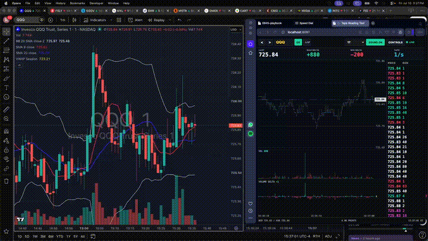

# tape-reading-tool

A compact tape reader for split-second scalping with IBKR or Massive market data. It renders tick bars, rolling 5/15/60-second tape pressure, and a narrow color-coded time-and-sales stream. Live trades and quotes can be recorded to SQLite and replayed later.



## What it does

- Connects to TWS or IB Gateway through the socket API.
- Can alternatively use the official Massive Go client for REST backfills and a live stocks WebSocket.
- Requests `AllLast` tick-by-tick trades and a top-of-book quote stream.
- Aggregates `1T`, `10T`, `100T`, `1000T`, or custom tick bars in the browser.
- Shows total, buyer, and seller volume; signed delta and delta percent; shares and prints per second; midpoint movement in ticks; and relative pace for rolling 5, 15, and 60-second horizons.
- Treats 15 seconds as the primary tradeable pressure cycle, with 5 seconds for ignition and 60 seconds for context.
- Shows the maximum positive and minimum negative delta in large text.
- Retains a recent ticker history and caches a configurable number of IBKR subscriptions for fast switching back.
- Runs the sound path through an `AudioWorklet` mixer with distinct buy/sell timbres and size-sensitive emphasis.
- Batches WebSocket delivery at frame-scale intervals without threshold-filtering prints.
- Records live trades and quotes with server-side microsecond receipt times using an asynchronous, batched SQLite writer.
- Downloads IBKR or Massive historical trades and quotes for backfill.
- Replays a selected range at 0.25x–10x with pause, resume, stop, and go-to-minute seeking.
- Adds a replay-only one-minute candlestick chart with 09:30 session VWAP, 9 SMA, 20 SMA, 20-period/2-deviation Bollinger bands, and volume in its own pane.

The program is read-only. It does not place or manage orders.

## Requirements

- Go 1.23 or newer.
- TWS or IB Gateway running locally or on a reachable host.
- The TWS socket API enabled and the configured client ID available.
- Live market-data permissions for the instruments being watched.
- For Massive mode or backfill, a Massive subscription that includes the requested stock trades/quotes and a `MASSIVE_API_KEY`.
- A current Chromium, Chrome, Firefox, or Safari browser with AudioWorklet support.

IBKR's tick-by-tick behavior and request restrictions are documented in the [official tick-by-tick guide](https://interactivebrokers.github.io/tws-api/tick_data.html).

## Configure

Local defaults are in `.env` and detailed settings are in `config.yaml`.

```dotenv
IBKR_HOST=127.0.0.1
IBKR_PORT=7497
IBKR_CLIENT_ID=97
DEFAULT_TICKER=AAPL
PORT=8097
MASSIVE_API_KEY=replace_with_your_massive_api_key
```

Keep the real Massive key only in `.env`; `.env` and the `data/` recording directory are ignored by Git. The app loads `.env` automatically. `config.yaml` deliberately leaves `massive.api_key` blank.

Common socket ports are `7497` for TWS paper, `7496` for TWS live, `4002` for Gateway paper, and `4001` for Gateway live. Confirm the port in the API settings of the running TWS/Gateway instance.

The main settings worth changing during setup are:

```yaml
ibkr:
  exchange: SMART
  primary_exchange: ""
  market_data_type: 1
  subscription_cache: 3

tape:
  ring_size: 50000
  snapshot_trades: 12000
  websocket_batch: 16ms
  websocket_max_batch: 4096
```

`subscription_cache` keeps recent tick subscriptions alive for quick back-navigation and avoids immediately repeating the same tick-by-tick request. Keep it within the market-data capacity of the IBKR account.

## Run

Use the synthetic burst feed to verify the UI and sound without TWS:

```bash
./go.sh demo
```

Connect to IBKR:

```bash
./go.sh live
```

Connect to the Massive live stocks feed instead:

```bash
./go.sh massive -symbol IONQ
```

Both live modes continuously record trades and quotes into `data/tape.db`. Recording uses a large non-blocking queue, WAL mode, and batched commits so SQLite disk I/O does not run inside the feed callback. The terminal heartbeat reports dropped recording events if the queue is ever saturated.

Then open [http://localhost:8097](http://localhost:8097). `Ctrl-C` shuts down the HTTP server and IBKR connection cleanly.

An alternate config or listen address can be supplied from the CLI:

```bash
./go.sh live -config config.yaml -addr :8098
```

## Historical backfill

Massive is the preferred backfill for tape practice because its historical stock records provide precise SIP timestamps and the official Go client handles paginated REST results. Download one interval with:

```bash
./go.sh download -provider massive -symbol IONQ \
  -start "2026-07-17 04:00:00" -end "2026-07-17 20:00:00"
```

Use `-rth` to retain only 09:30–16:00 ET. Re-running an identical provider/symbol/range replaces that slice rather than duplicating it.

Large Massive downloads automatically retry transient HTTP/TCP failures with bounded exponential backoff. A retry resumes inclusively from the last SIP nanosecond and suppresses already-processed sequence records at that timestamp, so it neither restarts the day nor duplicates the resume boundary.

IBKR backfill is also available while TWS or IB Gateway is running:

```bash
./go.sh download -provider ibkr -symbol IONQ \
  -start "2026-07-17 04:00:00" -end "2026-07-17 20:00:00"
```

IBKR uses a separate client ID and deliberately paced `reqHistoricalTicks` pages. Its historical timestamps have one-second resolution, so Massive is generally more suitable for reconstructing intrasecond tape pacing. For the live tape, choose the feed whose entitlement and latency best match the execution setup.

## Replay practice

Start replay mode against the local database:

```bash
./go.sh replay -symbol IONQ -provider massive -source historical
```

Open the browser and press `REPLAY`. Pick the provider/data source, start and end time, and speed, then press `PLAY`. `PAUSE` freezes the tape and all three receipt-time horizons. Enter any local date and minute in `Go to minute`, then press `GO` to clear the old tape and resume from that minute. `RESUME` continues from the exact stored event after the pause.

On desktop, replay places the one-minute market chart beside the current tape-reading tool and keeps time and sales on the right. Yellow is exact trade-weighted VWAP beginning at 09:30 ET, red is the 9-period simple moving average, blue is the 20-period simple moving average, and white is the 20-period Bollinger envelope at two population standard deviations. Volume is rendered in a dedicated pane below price. Compact screens stack the market chart above the tape tool.

For Massive/IBKR historical records, the provider event timestamp acts as the replay receipt clock because no downloader can recover the original local arrival time. Live recordings preserve and replay the actual microsecond server receipt timestamp.

## Live diagnostics

`./go.sh live` prints bounded diagnostics to the terminal. The important stages are:

- `IBKR TCP probe succeeded`: the configured host and port are reachable.
- `IBKR API handshake complete`: TWS/Gateway accepted the client ID and protocol handshake.
- `next_valid_id ... API session is ready`: the API session completed startup.
- `IBKR subscription request`: quote and `AllLast` requests were sent for the symbol.
- `IBKR first quote` and `IBKR first trade`: market data is reaching the application.
- `IBKR heartbeat`: every five seconds, reports connection state, bid/ask, cumulative quote/trade callbacks, last-event times, and the latest IBKR status message.

The last stage printed identifies the failure boundary. Common examples:

- `TCP probe failed ... connection refused`: wrong host/port, API socket disabled, or Gateway not listening yet.
- Stops after `API handshake starting`: trusted-IP, API-version, or duplicate-client-ID problem.
- Handshake succeeds but an `IBKR error` follows the subscription: contract definition or market-data entitlement problem.
- Quotes increase but trades remain zero: the top-of-book subscription works, but tick-by-tick trade data is unavailable or not entitled.

Gateway farm-status messages are printed as `IBKR notice`; request and entitlement failures are printed as `IBKR error`. Individual prints are not logged, so diagnostics remain usable during a fast market.

## Controls

- Enter a ticker and press `Enter` or `GO`. The input selects its full contents on focus for quick replacement.
- Use the arrow buttons and recent-ticker dropdown to revisit symbols.
- Select the tick count from the toolbar. `CUSTOM` opens the controls panel.
- Use `CONTROLS` to change visible bars, tape rows, pane visibility, size visibility, and every sound parameter. `Master` controls the existing print cues; `Tape speed sound` has its own mute and volume controls; `Small prints` sets an audible floor for isolated, low-size trades.
- Press `SOUND START` once to satisfy the browser's audio gesture requirement. The same control then mutes/unmutes the existing print cues; the tape-speed background remains independent in `CONTROLS`.
- Press `/` while outside an input to focus the ticker field.

Browser settings are saved in local storage, so changes remain available on the next run without editing files.

## Trade classification

Time and sales uses the latest top-of-book quote at receipt time:

| Print | Color |
|---|---|
| Below bid | Magenta |
| At bid | Red |
| Between bid and ask | White |
| At ask | Green |
| Above ask | Yellow |

At-bid and below-bid size is negative delta. At-ask and above-ask size is positive delta. Prints between the quote use the standard tick rule: an uptick is positive, a downtick is negative, and an unchanged print carries the previous direction.

## Performance model

Live feed callbacks do constant, bounded work: quote lookup, classification, one ring write, and a non-blocking enqueue to the recorder. Each symbol uses a fixed-size ring rather than an ever-growing slice. WebSocket clients pull from sequence numbers in batches, so a slow client cannot block the feed callback or allocate a queue per print. If a client falls behind the ring, the UI reports the overwritten count as `LAGGED`.

The canvas redraws only when data or dimensions change. Time and sales reuses a fixed DOM row pool. Rolling horizon totals use cumulative counters and binary searches rather than rescanning the trade history. The three fixed rows refresh every 100 ms, while WebSocket delivery retains the configurable 16 ms default batch. Old browser history is pruned in chunks to avoid repeated front-of-array work at the open. The audio worklet receives every delivered print and performs synthesis off the main thread with a fixed voice pool. Above 60 trades per second it progressively thins, shortens, and lowers only small-print cues; large prints always bypass that limiter and take priority over small voices.

The optional tape-speed background follows the same rolling one-second receipt-time rate shown in the `TAPE` metric. It maps speed to both a rising low-frequency pitch and a faster amplitude pulse: approximately 126 Hz / 3.8 Hz at 30 prints/s, 179 Hz / 6.6 Hz at 123 prints/s, 263 Hz / 9.6 Hz at 300 prints/s, and 360 Hz / 12 Hz at 500 prints/s. It runs on a separate gain path and automatically ducks beneath the existing print cues.

## Verify

```bash
go test ./...
go test -race ./...
go build -buildvcs=false ./cmd/tape-reading-tool
node scripts/audio-worklet-check.mjs
```

With demo mode running, the dependency-free browser check drives local Chrome at the two target widths and saves screenshots under `/tmp`:

```bash
node scripts/browser-check.mjs
```

## Notes

- `AllLast` includes additional trade types such as combos, derivatives, and average-price trades when IBKR supplies them. This tool intentionally does not filter those prints.
- Exchange timestamps in the IBKR tick callback have one-second resolution. Rolling horizons, tape-rate measurement, and audio scheduling use the separate server-side local receipt time recorded in microseconds; browser batch-processing time is not used.
- Massive live mode also stamps each event when the Go server receives it; neither provider's browser WebSocket batching time is used for rolling metrics.
- The referenced `ticksonic-original` repository returned GitHub 404 during implementation. The mixer and synthesis path here were implemented directly from the requested behavior.
